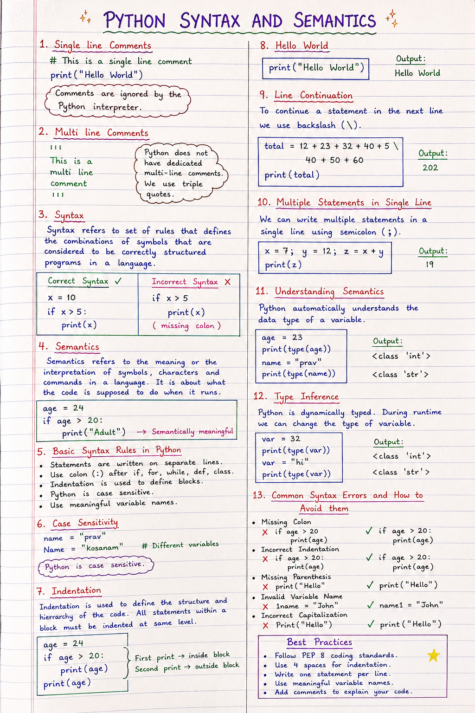

# Day 1 - Basics of python
# 📘 Python Syntax and Semantics

> Learn the fundamentals of Python syntax, semantics, comments, indentation, line continuation, and common syntax errors.


---

## 📑 Table of Contents

- [Introduction](#-introduction)
- [Comments in Python](#-comments-in-python)
  - [Single-Line Comments](#-single-line-comments)
  - [Multi-Line Comments](#-multi-line-comments)
- [What is Syntax?](#-what-is-syntax)
- [What is Semantics?](#-what-is-semantics)
- [Basic Syntax Rules in Python](#-basic-syntax-rules-in-python)
- [Case Sensitivity](#-case-sensitivity)
- [Indentation in Python](#-indentation-in-python)
- [Hello World Program](#-hello-world-program)
- [Line Continuation](#-line-continuation)
- [Multiple Statements on One Line](#-multiple-statements-on-one-line)
- [Understanding Semantics](#-understanding-semantics)
- [Type Inference](#-type-inference)
- [Common Syntax Errors and How to Avoid Them](#-common-syntax-errors-and-how-to-avoid-them)
- [Best Practices](#-best-practices)
- [Summary](#-summary)
- [Practice Exercises](#-practice-exercises)

---

## 🖼️ Visual Overview



---

# 📖 Introduction

Python is one of the most beginner-friendly programming languages because of its clean and readable syntax.

Before writing Python programs, it is important to understand two fundamental concepts:

- **Syntax** – The rules that define how Python code should be written.
- **Semantics** – The meaning and behavior of Python code during execution.

Understanding these concepts will help you write correct and efficient Python programs.

[⬆ Back to Top](#-table-of-contents)

---

# 💬 Comments in Python

Comments make your code easier to understand. They are ignored by the Python interpreter.

## 📝 Single-Line Comments

A single-line comment starts with the `#` symbol.

```python
# This is a single-line comment

print("Hello World")
```

---

## 📝 Multi-Line Comments

Python does not have a dedicated syntax for multi-line comments.

Instead, triple quotes are commonly used.

```python
'''
This is a
multi-line
comment
'''
```

or

```python
"""
This is another
multi-line
comment.
"""
```

> **Note:** Triple quotes actually create a multi-line string. When the string is not assigned to any variable, programmers often use it as a comment.

[⬆ Back to Top](#-table-of-contents)

---

# 🧠 What is Syntax?

**Syntax** refers to the set of rules that define the correct structure of a Python program.

It specifies how keywords, variables, operators, and punctuation should be arranged.

### ✅ Correct Syntax

```python
name = "Prav"
age = 24

print(name)
print(age)
```

### ❌ Incorrect Syntax

```python
if age > 20
    print(age)
```

The above code produces a **SyntaxError** because the colon (`:`) is missing.

[⬆ Back to Top](#-table-of-contents)

---

# 💡 What is Semantics?

**Semantics** refers to the meaning of Python statements.

While syntax checks whether code is written correctly, semantics determines what the code actually does.

Example:

```python
age = 24

if age > 20:
    print("Adult")
```

Output

```
Adult
```

The code is both syntactically correct and semantically meaningful.

[⬆ Back to Top](#-table-of-contents)

---

# 📜 Basic Syntax Rules in Python

Python follows a few simple rules:

- Statements are usually written on separate lines.
- Python is **case-sensitive**.
- Use indentation to define code blocks.
- Use a colon (`:`) after `if`, `for`, `while`, `def`, and `class`.
- Follow consistent formatting for better readability.

Example

```python
name = "Prav"
age = 24

print(name)
print(age)
```

[⬆ Back to Top](#-table-of-contents)

---

# 🔤 Case Sensitivity

Python treats uppercase and lowercase letters differently.

```python
name = "Prav"
Name = "Kosanam"

print(name)
print(Name)
```

Output

```
Prav
Kosanam
```

Although the variable names look similar, Python treats them as two different variables.

> **Remember:** `name`, `Name`, and `NAME` are all different identifiers.

[⬆ Back to Top](#-table-of-contents)

---

# 📌 Indentation in Python

Unlike many programming languages that use braces (`{}`) to define blocks of code, Python uses **indentation**.

All statements within the same block must have the same indentation level.

Example

```python
age = 24

if age > 20:
    print(age)

print(age)
```

Output

```
24
24
```

### Why Indentation Matters

Correct

```python
if True:
    print("Correct")
```

Incorrect

```python
if True:
print("Incorrect")
```

The second example raises an **IndentationError**.

[⬆ Back to Top](#-table-of-contents)

---

# 🌍 Hello World Program

The first Python program traditionally prints **Hello, World!**

```python
print("Hello World")
```

Output

```
Hello World
```

[⬆ Back to Top](#-table-of-contents)

---

# ➡️ Line Continuation

Long statements can be split across multiple lines using a backslash (`\`).

```python
total = 12 + 23 + 32 + 40 + 5 + \
40 + 50 + 60

print(total)
```

A better approach is to use parentheses.

```python
total = (
    12 + 23 + 32 + 40 + 5 +
    40 + 50 + 60
)

print(total)
```

> **Best Practice:** Prefer parentheses over the backslash for improved readability.

[⬆ Back to Top](#-table-of-contents)

---

# ➕ Multiple Statements on One Line

Python allows multiple statements on a single line using semicolons (`;`).

```python
x = 7; y = 12; z = x + y

print(z)
```

Output

```
19
```

> Although valid, writing one statement per line is considered better programming practice.

[⬆ Back to Top](#-table-of-contents)

---

# 🔍 Understanding Semantics

Python automatically determines the data type of a variable.

```python
age = 23

print(type(age))
```

Output

```
<class 'int'>
```

Another example

```python
name = "Prav"

print(type(name))
```

Output

```
<class 'str'>
```

[⬆ Back to Top](#-table-of-contents)

---

# 🔄 Type Inference

Python is a **dynamically typed** programming language.

The interpreter automatically infers the type of a variable.

```python
var = 32

print(type(var))
```

Output

```
<class 'int'>
```

Later, the same variable can store a string.

```python
var = "Hi"

print(type(var))
```

Output

```
<class 'str'>
```

This behavior is known as **dynamic typing** or **type inference**.

[⬆ Back to Top](#-table-of-contents)

---

# ❌ Common Syntax Errors and How to Avoid Them

## 1. Missing Colon

Incorrect

```python
if age > 20
    print(age)
```

Correct

```python
if age > 20:
    print(age)
```

---

## 2. Incorrect Indentation

Incorrect

```python
if age > 20:
print(age)
```

Correct

```python
if age > 20:
    print(age)
```

---

## 3. Missing Parenthesis

Incorrect

```python
print("Hello"
```

Correct

```python
print("Hello")
```

---

## 4. Invalid Variable Name

Incorrect

```python
1name = "John"
```

Correct

```python
name1 = "John"
```

---

## 5. Incorrect Capitalization

Incorrect

```python
Print("Hello")
```

Correct

```python
print("Hello")
```

Python keywords and built-in functions are case-sensitive.

[⬆ Back to Top](#-table-of-contents)

---

# ✅ Best Practices

- Use meaningful variable names.
- Follow PEP 8 coding standards.
- Use four spaces for indentation.
- Write one statement per line whenever possible.
- Keep your code simple and readable.
- Add comments where necessary.
- Prefer parentheses instead of backslashes for long expressions.

[⬆ Back to Top](#-table-of-contents)

---

# 📝 Summary

In this chapter, you learned about:

- ✅ Python comments
- ✅ Single-line and multi-line comments
- ✅ Syntax and semantics
- ✅ Basic syntax rules
- ✅ Case sensitivity
- ✅ Indentation
- ✅ Hello World program
- ✅ Line continuation
- ✅ Multiple statements in one line
- ✅ Type inference
- ✅ Common syntax errors
- ✅ Best coding practices

You now have a strong foundation for writing clean and correct Python programs.

[⬆ Back to Top](#-table-of-contents)

---

# 💻 Practice Exercises

### Exercise 1

Print the following output:

```
Hello, Python!
```

---

### Exercise 2

Create two variables:

- `name`
- `age`

Print both values.

---

### Exercise 3

Check the data type of the following variables.

```python
name = "Alice"
age = 25
height = 5.8
is_student = True
```

---

### Exercise 4

Write an `if` statement that prints `"Eligible"` if the age is greater than 18.

---

### Exercise 5

Assign an integer to a variable, print its type, then assign a string to the same variable and print its type again.

---

## 🎯 What's Next?

In the next chapter, you'll learn about:

- Variables
- Data Types
- Input and Output
- Python Keywords
- Naming Conventions

Happy Coding! 🚀


