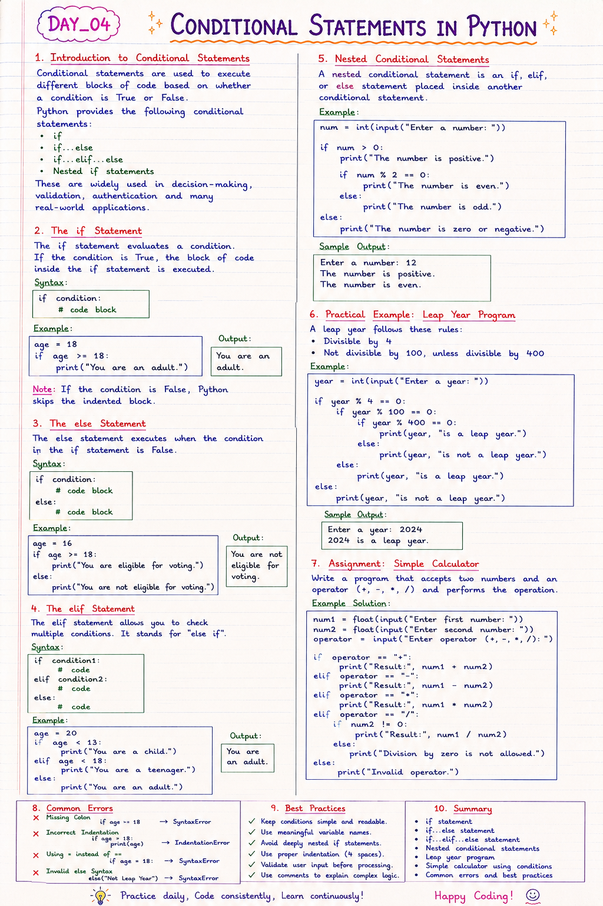

# 📘 Day 04: Conditional Statements in Python

> Conditional statements allow Python programs to make decisions based on different conditions. They are one of the most important building blocks of programming logic.

---

## 📑 Table of Contents

- [Introduction to Conditional Statements](#-introduction-to-conditional-statements)
- [The `if` Statement](#-the-if-statement)
- [The `else` Statement](#-the-else-statement)
- [The `elif` Statement](#-the-elif-statement)
- [Nested Conditional Statements](#-nested-conditional-statements)
- [Practical Example: Leap Year Program](#-practical-example-leap-year-program)
- [Assignment: Simple Calculator](#-assignment-simple-calculator)
- [Common Errors](#-common-errors)
- [Best Practices](#-best-practices)
- [Summary](#-summary)
- [Practice Exercises](#-practice-exercises)

---



---

# 📖 Introduction to Conditional Statements

Conditional statements are used to execute different blocks of code based on whether a condition is **True** or **False**.

Python provides the following conditional statements:

- `if`
- `if...else`
- `if...elif...else`
- Nested `if` statements

Conditional statements are widely used in decision-making, validation, authentication, and many real-world applications.

[⬆ Back to Top](#-table-of-contents)

---

# 🔹 The `if` Statement

The `if` statement evaluates a condition.

If the condition is **True**, the block of code inside the `if` statement is executed.

## Syntax

```python
if condition:
    # code block
```

### Example

```python
age = 18

if age >= 18:
    print("You are an adult.")
```

### Output

```
You are an adult.
```

> **Note:** If the condition is `False`, Python skips the indented block.

[⬆ Back to Top](#-table-of-contents)

---

# 🔹 The `else` Statement

The `else` statement executes when the condition in the `if` statement is **False**.

## Syntax

```python
if condition:
    # code block
else:
    # code block
```

### Example

```python
age = 16

if age >= 18:
    print("You are eligible for voting.")
else:
    print("You are not eligible for voting.")
```

### Output

```
You are not eligible for voting.
```

[⬆ Back to Top](#-table-of-contents)

---

# 🔹 The `elif` Statement

The `elif` statement stands for **"else if"**.

It allows multiple conditions to be checked one after another.

## Syntax

```python
if condition1:
    # code
elif condition2:
    # code
else:
    # code
```

### Example

```python
age = 20

if age < 13:
    print("You are a child.")
elif age < 18:
    print("You are a teenager.")
else:
    print("You are an adult.")
```

### Output

```
You are an adult.
```

[⬆ Back to Top](#-table-of-contents)

---

# 🔹 Nested Conditional Statements

A nested conditional statement is an `if`, `elif`, or `else` statement placed inside another conditional statement.

Nested conditions are useful when multiple decisions depend on one another.

### Example

```python
num = int(input("Enter a number: "))

if num > 0:
    print("The number is positive.")

    if num % 2 == 0:
        print("The number is even.")
    else:
        print("The number is odd.")
else:
    print("The number is zero or negative.")
```

### Sample Output

```
Enter a number: 12

The number is positive.
The number is even.
```

[⬆ Back to Top](#-table-of-contents)

---

# 🌍 Practical Example: Leap Year Program

A leap year follows these rules:

- Divisible by **4**
- Not divisible by **100**, unless divisible by **400**

### Program

```python
year = int(input("Enter a year: "))

if year % 4 == 0:
    if year % 100 == 0:
        if year % 400 == 0:
            print(year, "is a leap year.")
        else:
            print(year, "is not a leap year.")
    else:
        print(year, "is a leap year.")
else:
    print(year, "is not a leap year.")
```

### Sample Output

```
Enter a year: 2024

2024 is a leap year.
```

[⬆ Back to Top](#-table-of-contents)

---

# 🧮 Assignment: Simple Calculator

Write a program that accepts:

- First number
- Second number
- Arithmetic operator (`+`, `-`, `*`, `/`)

Then perform the selected operation.

### Example Solution

```python
num1 = float(input("Enter first number: "))
num2 = float(input("Enter second number: "))
operator = input("Enter operator (+, -, *, /): ")

if operator == "+":
    print("Result:", num1 + num2)

elif operator == "-":
    print("Result:", num1 - num2)

elif operator == "*":
    print("Result:", num1 * num2)

elif operator == "/":
    if num2 != 0:
        print("Result:", num1 / num2)
    else:
        print("Division by zero is not allowed.")

else:
    print("Invalid operator.")
```

[⬆ Back to Top](#-table-of-contents)

---

# ❌ Common Errors

## 1. Missing Colon

❌ Incorrect

```python
if age >= 18
    print(age)
```

✅ Correct

```python
if age >= 18:
    print(age)
```

---

## 2. Incorrect Indentation

❌ Incorrect

```python
if age >= 18:
print(age)
```

✅ Correct

```python
if age >= 18:
    print(age)
```

---

## 3. Using `=` Instead of `==`

❌ Incorrect

```python
if age = 18:
```

✅ Correct

```python
if age == 18:
```

---

## 4. Invalid `else` Syntax

❌ Incorrect

```python
else("Not Leap Year")
```

✅ Correct

```python
else:
    print("Not Leap Year")
```

[⬆ Back to Top](#-table-of-contents)

---

# ✅ Best Practices

- Keep conditions simple and readable.
- Use meaningful variable names.
- Avoid deeply nested `if` statements whenever possible.
- Use proper indentation (4 spaces).
- Validate user input before processing it.
- Use comments to explain complex logic.

[⬆ Back to Top](#-table-of-contents)

---

# 📚 Summary

In this chapter, you learned:

- ✅ `if` statement
- ✅ `if...else` statement
- ✅ `if...elif...else`
- ✅ Nested conditional statements
- ✅ Leap year program
- ✅ Simple calculator using conditions
- ✅ Common errors
- ✅ Best practices

Conditional statements are the foundation of decision-making in Python and are widely used in real-world applications.

[⬆ Back to Top](#-table-of-contents)

---

# 💻 Practice Exercises

### Exercise 1

Write a program to check whether a number is positive, negative, or zero.

---

### Exercise 2

Check whether a person is eligible to vote.

---

### Exercise 3

Find the largest among three numbers using `if...elif...else`.

---

### Exercise 4

Write a program to determine whether a year is a leap year.

---

### Exercise 5

Build a simple calculator that performs:

- Addition
- Subtraction
- Multiplication
- Division

using conditional statements.

---

## 🎯 What's Next?

In **Day 04**, Chapter-2 you'll learn about:

- Loops (`for` and `while`)
- Loop Control Statements (`break`, `continue`, `pass`)
- Nested Loops
- Practical Loop Examples

Happy Coding! 🚀
