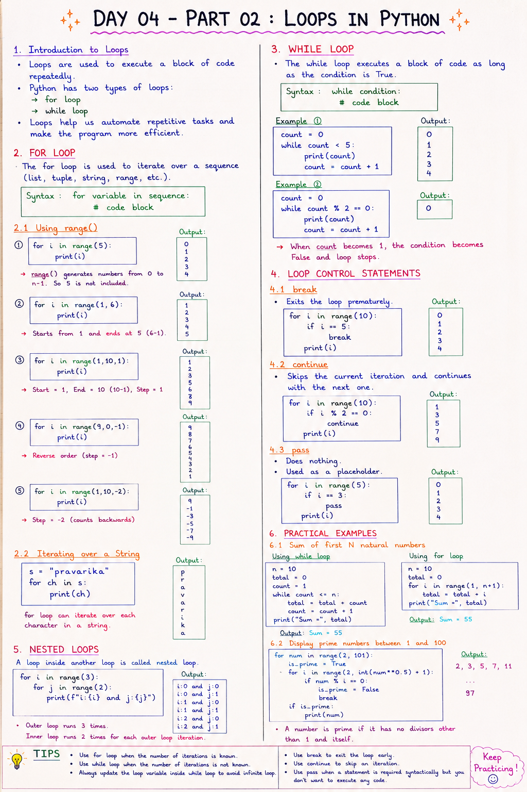

# 📘 Day 04 - Part 02: Loops in Python

> Loops are used to execute a block of code repeatedly. They help automate repetitive tasks and make programs more efficient.

---

## 📑 Table of Contents

- [Introduction to Loops](#-introduction-to-loops)
- [The `for` Loop](#-the-for-loop)
  - [Using `range()`](#using-range)
  - [Iterating Over a String](#iterating-over-a-string)
- [The `while` Loop](#-the-while-loop)
- [Loop Control Statements](#-loop-control-statements)
  - [break](#break)
  - [continue](#continue)
  - [pass](#pass)
- [Nested Loops](#-nested-loops)
- [Practical Examples](#-practical-examples)
- [Common Errors](#-common-errors)
- [Best Practices](#-best-practices)
- [Summary](#-summary)
- [Practice Exercises](#-practice-exercises)

---



---

# 📖 Introduction to Loops

Loops allow us to execute the same block of code multiple times without rewriting it.

Python provides two types of loops:

- **for loop**
- **while loop**

Loops are commonly used for:

- Processing collections
- Repeating tasks
- Reading files
- Performing calculations
- Searching data

[⬆ Back to Top](#-table-of-contents)

---

# 🔁 The `for` Loop

The `for` loop is used to iterate over a sequence such as a list, tuple, string, or range of numbers.

## Syntax

```python
for variable in sequence:
    # code block
```

---

## Using `range()`

### Example 1

```python
for i in range(5):
    print(i)
```

### Output

```
0
1
2
3
4
```

> **Note:** The last value (`5`) is **not included**.

---

### Example 2

```python
for i in range(1, 6):
    print(i)
```

Output

```
1
2
3
4
5
```

`range(start, stop)`

- Starts from **start**
- Ends at **stop - 1**

---

### Example 3

```python
for i in range(1, 10, 2):
    print(i)
```

Output

```
1
3
5
7
9
```

The third parameter is called the **step size**.

---

### Reverse Iteration

```python
for i in range(10, 0, -1):
    print(i)
```

Output

```
10
9
8
7
6
5
4
3
2
1
```

[⬆ Back to Top](#-table-of-contents)

---

## Iterating Over a String

Strings are iterable.

```python
name = "Pravarika"

for ch in name:
    print(ch)
```

Output

```
P
r
a
v
a
r
i
k
a
```

[⬆ Back to Top](#-table-of-contents)

---

# 🔄 The `while` Loop

A `while` loop executes as long as the specified condition is **True**.

## Syntax

```python
while condition:
    # code
```

Example

```python
count = 0

while count < 5:
    print(count)
    count += 1
```

Output

```
0
1
2
3
4
```

---

Another Example

```python
count = 0

while count % 2 == 0:
    print(count)
    count += 1
```

Output

```
0
```

Since `count` becomes `1`, the condition becomes **False**.

[⬆ Back to Top](#-table-of-contents)

---

# ⏹️ Loop Control Statements

Python provides three loop control statements.

- `break`
- `continue`
- `pass`

---

## break

The `break` statement immediately terminates the loop.

```python
for i in range(10):
    if i == 5:
        break

    print(i)
```

Output

```
0
1
2
3
4
```

---

## continue

The `continue` statement skips the current iteration and moves to the next iteration.

```python
for i in range(10):

    if i % 2 == 0:
        continue

    print(i)
```

Output

```
1
3
5
7
9
```

---

## pass

The `pass` statement does nothing.

It acts as a placeholder.

```python
for i in range(5):

    if i == 3:
        pass

    print(i)
```

Output

```
0
1
2
3
4
```

[⬆ Back to Top](#-table-of-contents)

---

# 🔁 Nested Loops

A nested loop is a loop inside another loop.

Example

```python
for i in range(3):

    for j in range(2):
        print(f"i = {i}, j = {j}")
```

Output

```
i = 0, j = 0
i = 0, j = 1
i = 1, j = 0
i = 1, j = 1
i = 2, j = 0
i = 2, j = 1
```

[⬆ Back to Top](#-table-of-contents)

---

# 🌍 Practical Examples

## Example 1: Sum of First N Natural Numbers (Using `while`)

```python
n = 10

total = 0
count = 1

while count <= n:
    total += count
    count += 1

print("Sum =", total)
```

Output

```
Sum = 55
```

---

## Example 2: Sum of First N Natural Numbers (Using `for`)

```python
n = 10

total = 0

for i in range(1, n + 1):
    total += i

print("Sum =", total)
```

Output

```
Sum = 55
```

---

## Example 3: Display Prime Numbers Between 1 and 100

```python
for num in range(2, 101):

    is_prime = True

    for i in range(2, int(num ** 0.5) + 1):

        if num % i == 0:
            is_prime = False
            break

    if is_prime:
        print(num)
```

Output

```
2
3
5
7
11
13
...
97
```

[⬆ Back to Top](#-table-of-contents)

---

# ❌ Common Errors

## Infinite Loop

```python
count = 0

while count < 5:
    print(count)
```

❌ Forgot to increment `count`.

---

## Incorrect Indentation

```python
for i in range(5):
print(i)
```

Correct

```python
for i in range(5):
    print(i)
```

---

## Incorrect `range()`

```python
range(1,10,-1)
```

This returns nothing because the step direction is incorrect.

Correct

```python
range(10,0,-1)
```

[⬆ Back to Top](#-table-of-contents)

---

# ✅ Best Practices

- Use a `for` loop when the number of iterations is known.
- Use a `while` loop when the stopping condition is unknown.
- Avoid infinite loops.
- Use `break` carefully.
- Use `continue` only when necessary.
- Keep nested loops as simple as possible.
- Write readable loop conditions.

[⬆ Back to Top](#-table-of-contents)

---

# 📚 Summary

In this chapter, you learned:

- ✅ Introduction to loops
- ✅ `for` loop
- ✅ `range()` function
- ✅ Iterating through strings
- ✅ `while` loop
- ✅ `break`
- ✅ `continue`
- ✅ `pass`
- ✅ Nested loops
- ✅ Practical examples
- ✅ Common mistakes
- ✅ Best practices

Loops are one of the most powerful programming concepts because they help automate repetitive tasks efficiently.

[⬆ Back to Top](#-table-of-contents)

---

# 💻 Practice Exercises

### Exercise 1

Print numbers from **1 to 20** using a `for` loop.

---

### Exercise 2

Print the multiplication table of **7**.

---

### Exercise 3

Print all even numbers between **1 and 100**.

---

### Exercise 4

Calculate the factorial of a number using a `while` loop.

---

### Exercise 5

Print all prime numbers between **1 and 100**.

---

### Exercise 6

Print the following pattern using nested loops.

```
*
**
***
****
*****
```

---

## 🎯 What's Next?

In **Day 05**, you'll learn about Python **Data Structures**, including:

- 📋 Lists
- 🔒 Tuples
- 🎯 Sets
- 📖 Dictionaries
- 🔍 Indexing and Slicing
- ➕ Adding, Updating, and Removing Elements
- 🔄 Iterating Through Data Structures
- 💡 Common Built-in Methods
- ⚠️ Common Errors and Best Practices

These data structures are essential for storing, organizing, and manipulating collections of data efficiently.

Happy Coding! 🚀