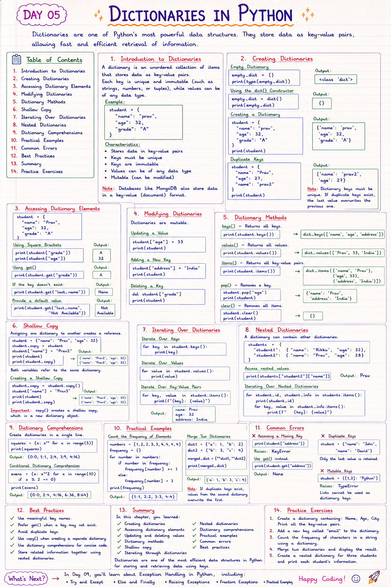

# 📘 Day 05: Dictionaries in Python

> Dictionaries are one of Python's most powerful data structures. They store data as **key-value pairs**, allowing fast and efficient retrieval of information.

---

## 📑 Table of Contents

- [Introduction to Dictionaries](#-introduction-to-dictionaries)
- [Creating Dictionaries](#-creating-dictionaries)
- [Accessing Dictionary Elements](#-accessing-dictionary-elements)
- [Modifying Dictionaries](#-modifying-dictionaries)
- [Dictionary Methods](#-dictionary-methods)
- [Shallow Copy](#-shallow-copy)
- [Iterating Over Dictionaries](#-iterating-over-dictionaries)
- [Nested Dictionaries](#-nested-dictionaries)
- [Dictionary Comprehensions](#-dictionary-comprehensions)
- [Practical Examples](#-practical-examples)
- [Common Errors](#-common-errors)
- [Best Practices](#-best-practices)
- [Summary](#-summary)
- [Practice Exercises](#-practice-exercises)

---



---

# 📖 Introduction to Dictionaries

A **dictionary** is an unordered collection of items that stores data as **key-value pairs**.

Each key is unique and immutable (such as strings, numbers, or tuples), while values can be of any data type.

Example

```python
student = {
    "name": "prav",
    "age": 32,
    "grade": "A"
}
```

### Characteristics

- Stores data in key-value pairs
- Keys must be unique
- Keys are immutable
- Values can be of any data type
- Mutable (can be modified)

> **Note:** Databases like **MongoDB** also store data in a key-value (document) format.

[⬆ Back to Top](#-table-of-contents)

---

# 📝 Creating Dictionaries

### Empty Dictionary

```python
empty_dict = {}

print(type(empty_dict))
```

Output

```
<class 'dict'>
```

---

### Using the `dict()` Constructor

```python
empty_dict = dict()

print(empty_dict)
```

Output

```
{}
```

---

### Creating a Dictionary

```python
student = {
    "name": "prav",
    "age": 32,
    "grade": "A"
}

print(student)
```

Output

```
{'name': 'prav', 'age': 32, 'grade': 'A'}
```

---

### Duplicate Keys

```python
student = {
    "name": "Prav",
    "age": 27,
    "name": "prav2"
}

print(student)
```

Output

```
{'name': 'prav', 'age': 27}
```

> **Note:** Dictionary keys must be unique. If duplicate keys exist, the last value overwrites the previous one.

[⬆ Back to Top](#-table-of-contents)

---

# 🔍 Accessing Dictionary Elements

```python
student = {
    "name": "Prav",
    "age": 32,
    "grade": "A"
}
```

### Using Square Brackets

```python
print(student["grade"])
print(student["age"])
```

Output

```
A
32
```

---

### Using `get()`

```python
print(student.get("grade"))
```

Output

```
A
```

If the key doesn't exist:

```python
print(student.get("last_name"))
```

Output

```
None
```

Provide a default value.

```python
print(student.get("last_name", "Not Available"))
```

Output

```
Not Available
```

[⬆ Back to Top](#-table-of-contents)

---

# ✏️ Modifying Dictionaries

Dictionaries are mutable.

### Updating a Value

```python
student["age"] = 33

print(student)
```

---

### Adding a New Key

```python
student["address"] = "India"

print(student)
```

---

### Deleting a Key

```python
del student["grade"]

print(student)
```

[⬆ Back to Top](#-table-of-contents)

---

# ⚙️ Dictionary Methods

### `keys()`

Returns all keys.

```python
print(student.keys())
```

---

### `values()`

Returns all values.

```python
print(student.values())
```

---

### `items()`

Returns all key-value pairs.

```python
print(student.items())
```

---

### `pop()`

Removes a key.

```python
student.pop("age")

print(student)
```

---

### `clear()`

Removes all items.

```python
student.clear()

print(student)
```

[⬆ Back to Top](#-table-of-contents)

---

# 📄 Shallow Copy

Assigning one dictionary to another creates a reference.

```python
student = {
    "name": "Prav",
    "age": 32
}

student_copy = student

student["name"] = "Prav2"

print(student)
print(student_copy)
```

Output

```
{'name': 'Prav2', 'age': 32}
{'name': 'Prav2', 'age': 32}
```

Both variables refer to the same dictionary.

---

### Creating a Shallow Copy

```python
student_copy = student.copy()

student["name"] = "Prav3"

print(student)
print(student_copy)
```

Output

```
{'name': 'Prav3', 'age': 32}
{'name': 'Prav2', 'age': 32}
```

> **Important:** `copy()` creates a shallow copy, which is a new dictionary object.

[⬆ Back to Top](#-table-of-contents)

---

# 🔄 Iterating Over Dictionaries

### Iterate Over Keys

```python
for key in student.keys():
    print(key)
```

---

### Iterate Over Values

```python
for value in student.values():
    print(value)
```

---

### Iterate Over Key-Value Pairs

```python
for key, value in student.items():
    print(f"{key}: {value}")
```

Output

```
name: Prav
age: 32
```

[⬆ Back to Top](#-table-of-contents)

---

# 🧩 Nested Dictionaries

A dictionary can contain other dictionaries.

```python
students = {
    "student1": {
        "name": "Rikku",
        "age": 32
    },
    "student2": {
        "name": "Prav",
        "age": 28
    }
}
```

Access nested values.

```python
print(students["student2"]["name"])
```

Output

```
Prav
```

### Iterating Over Nested Dictionaries

```python
for student_id, student_info in students.items():

    print(student_id)

    for key, value in student_info.items():
        print(f"{key}: {value}")
```

[⬆ Back to Top](#-table-of-contents)

---

# 🚀 Dictionary Comprehensions

Create dictionaries in a single line.

```python
squares = {x: x**2 for x in range(5)}

print(squares)
```

Output

```
{0:0, 1:1, 2:4, 3:9, 4:16}
```

---

### Conditional Dictionary Comprehension

```python
evens = {x: x**2 for x in range(10) if x % 2 == 0}

print(evens)
```

Output

```
{0:0, 2:4, 4:16, 6:36, 8:64}
```

[⬆ Back to Top](#-table-of-contents)

---

# 🌍 Practical Examples

## Count the Frequency of Elements

```python
numbers = [1,2,2,3,3,3,4,4,4,4]

frequency = {}

for number in numbers:

    if number in frequency:
        frequency[number] += 1
    else:
        frequency[number] = 1

print(frequency)
```

Output

```
{1:1, 2:2, 3:3, 4:4}
```

---

## Merge Two Dictionaries

```python
dict1 = {
    "a": 1,
    "b": 2
}

dict2 = {
    "b": 3,
    "c": 4
}

merged_dict = {**dict1, **dict2}

print(merged_dict)
```

Output

```
{'a': 1, 'b': 3, 'c': 4}
```

> **Note:** If duplicate keys exist, values from the second dictionary overwrite the first.

[⬆ Back to Top](#-table-of-contents)

---

# ❌ Common Errors

### Accessing a Missing Key

```python
print(student["address"])
```

Raises

```
KeyError
```

Use `get()` instead.

```python
print(student.get("address"))
```

---

### Duplicate Keys

```python
student = {
    "name": "John",
    "name": "David"
}
```

Only the last value is retained.

---

### Mutable Keys

```python
student = {
    [1,2]: "Python"
}
```

Raises

```
TypeError
```

Lists cannot be used as dictionary keys.

[⬆ Back to Top](#-table-of-contents)

---

# ✅ Best Practices

- Use meaningful key names.
- Prefer `get()` when a key may not exist.
- Avoid duplicate keys.
- Use `copy()` when creating a separate dictionary.
- Use dictionary comprehensions for concise code.
- Store related information together using nested dictionaries.

[⬆ Back to Top](#-table-of-contents)

---

# 📚 Summary

In this chapter, you learned:

- ✅ Creating dictionaries
- ✅ Accessing dictionary elements
- ✅ Updating and deleting values
- ✅ Dictionary methods
- ✅ Shallow copy
- ✅ Iterating through dictionaries
- ✅ Nested dictionaries
- ✅ Dictionary comprehensions
- ✅ Practical examples
- ✅ Common errors
- ✅ Best practices

Dictionaries are one of the most efficient data structures in Python for storing and retrieving data using keys.

[⬆ Back to Top](#-table-of-contents)

---

# 💻 Practice Exercises

### Exercise 1

Create a dictionary containing:

- Name
- Age
- City

Print all the key-value pairs.

---

### Exercise 2

Add a new key called `"email"` to the dictionary.

---

### Exercise 3

Count the frequency of characters in a string using a dictionary.

---

### Exercise 4

Merge two dictionaries and display the result.

---

### Exercise 5

Create a nested dictionary for three students and print each student's information.

---

## 🎯 What's Next?

In **Day 09**, you'll learn about **Exception Handling in Python**, including:

- Try and Except
- Else and Finally
- Raising Exceptions
- Custom Exceptions
- Practical Examples

Happy Coding! 🚀