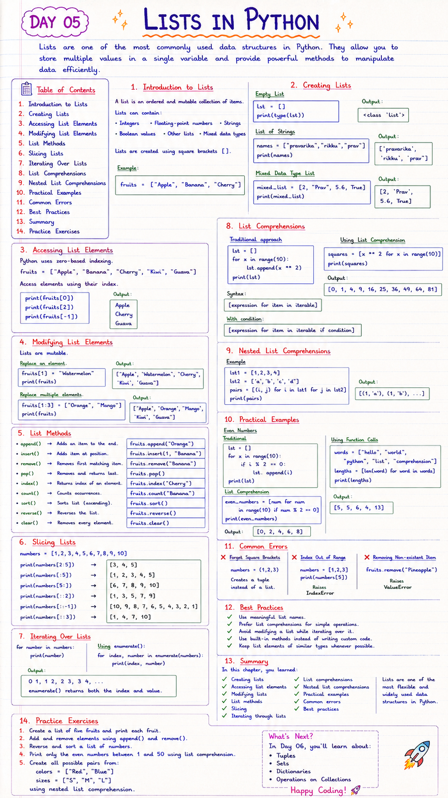

# 📘 Day 05: Lists in Python

> Lists are one of the most commonly used data structures in Python. They allow you to store multiple values in a single variable and provide powerful methods to manipulate data efficiently.

---

## 📑 Table of Contents

- [Introduction to Lists](#-introduction-to-lists)
- [Creating Lists](#-creating-lists)
- [Accessing List Elements](#-accessing-list-elements)
- [Modifying List Elements](#-modifying-list-elements)
- [List Methods](#-list-methods)
- [Slicing Lists](#-slicing-lists)
- [Iterating Over Lists](#-iterating-over-lists)
- [List Comprehensions](#-list-comprehensions)
- [Nested List Comprehensions](#-nested-list-comprehensions)
- [Practical Examples](#-practical-examples)
- [Common Errors](#-common-errors)
- [Best Practices](#-best-practices)
- [Summary](#-summary)
- [Practice Exercises](#-practice-exercises)

---



---

# 📖 Introduction to Lists

A **list** is an ordered and mutable collection of items.

Lists can contain:

- Integers
- Floating-point numbers
- Strings
- Boolean values
- Other lists
- Mixed data types

Lists are created using square brackets (`[]`).

Example

```python
fruits = ["Apple", "Banana", "Cherry"]
```

[⬆ Back to Top](#-table-of-contents)

---

# 📝 Creating Lists

## Empty List

```python
lst = []

print(type(lst))
```

Output

```
<class 'list'>
```

---

## List of Strings

```python
names = ["pravarika","rikku","prav"]

print(names)
```

Output

```
['pravarika', 'rikku', 'prav']
```

---

## Mixed Data Type List

```python
mixed_list = [2, "Prav", 5.6, True]

print(mixed_list)
```

Output

```
[2, 'Prav', 5.6, True]
```

[⬆ Back to Top](#-table-of-contents)

---

# 🔍 Accessing List Elements

Python uses **zero-based indexing**.

```python
fruits = ["Apple", "Banana", "Cherry", "Kiwi", "Guava"]
```

Access elements using their index.

```python
print(fruits[0])

print(fruits[2])

print(fruits[-1])
```

Output

```
Apple

Cherry

Guava
```

[⬆ Back to Top](#-table-of-contents)

---

# ✂️ Slicing Lists

Slicing extracts a portion of a list.

```python
print(fruits[1:])
```

Output

```
['Banana', 'Cherry', 'Kiwi', 'Guava']
```

---

```python
print(fruits[1:3])
```

Output

```
['Banana', 'Cherry']
```

> **Note:** The ending index is **not included**.

[⬆ Back to Top](#-table-of-contents)

---

# ✏️ Modifying List Elements

Lists are mutable.

Replace an element.

```python
fruits[1] = "Watermelon"

print(fruits)
```

Output

```
['Apple', 'Watermelon', 'Cherry', 'Kiwi', 'Guava']
```

Replace multiple elements.

```python
fruits[1:3] = ["Orange", "Mango"]

print(fruits)
```

Output

```
['Apple', 'Orange', 'Mango', 'Kiwi', 'Guava']
```

[⬆ Back to Top](#-table-of-contents)

---

# ⚙️ List Methods

### append()

Adds an item to the end.

```python
fruits.append("Orange")
```

---

### insert()

Adds an item at a specified position.

```python
fruits.insert(1, "Banana")
```

---

### remove()

Removes the first matching element.

```python
fruits.remove("Banana")
```

---

### pop()

Removes and returns the last element.

```python
fruits.pop()
```

---

### index()

Returns the index of an element.

```python
fruits.index("Cherry")
```

---

### count()

Counts the number of occurrences.

```python
fruits.insert(2, "Banana")

print(fruits.count("Banana"))
```

---

### sort()

Sorts the list in ascending order.

```python
fruits.sort()
```

---

### reverse()

Reverses the list.

```python
fruits.reverse()
```

---

### clear()

Removes every element.

```python
fruits.clear()
```

[⬆ Back to Top](#-table-of-contents)

---

# 🔪 More Slicing Examples

```python
numbers = [1,2,3,4,5,6,7,8,9,10]
```

```python
print(numbers[2:5])
```

Output

```
[3,4,5]
```

---

```python
print(numbers[:5])
```

Output

```
[1,2,3,4,5]
```

---

```python
print(numbers[5:])
```

Output

```
[6,7,8,9,10]
```

---

```python
print(numbers[::2])
```

Output

```
[1,3,5,7,9]
```

---

```python
print(numbers[::-1])
```

Output

```
[10,9,8,7,6,5,4,3,2,1]
```

---

```python
print(numbers[::3])
```

Output

```
[1,4,7,10]
```

[⬆ Back to Top](#-table-of-contents)

---

# 🔄 Iterating Over Lists

```python
for number in numbers:
    print(number)
```

---

Using `enumerate()`

```python
for index, number in enumerate(numbers):
    print(index, number)
```

Output

```
0 1
1 2
2 3
...
```

`enumerate()` returns both the index and value.

[⬆ Back to Top](#-table-of-contents)

---

# 🚀 List Comprehensions

List comprehensions provide a shorter syntax for creating lists.

Traditional approach

```python
lst = []

for x in range(10):
    lst.append(x ** 2)

print(lst)
```

Using List Comprehension

```python
squares = [x ** 2 for x in range(10)]

print(squares)
```

Output

```
[0,1,4,9,16,25,36,49,64,81]
```

### Syntax

```python
[expression for item in iterable]
```

With condition

```python
[expression for item in iterable if condition]
```

[⬆ Back to Top](#-table-of-contents)

---

# 🔀 Nested List Comprehensions

Example

```python
lst1 = [1,2,3,4]
lst2 = ['a','b','c','d']

pairs = [(i, j) for i in lst1 for j in lst2]

print(pairs)
```

Output

```
[(1,'a'), (1,'b'), ...]
```

[⬆ Back to Top](#-table-of-contents)

---

# 🌍 Practical Examples

## Even Numbers

Traditional

```python
lst = []

for i in range(10):

    if i % 2 == 0:
        lst.append(i)

print(lst)
```

List Comprehension

```python
even_numbers = [num for num in range(10) if num % 2 == 0]

print(even_numbers)
```

Output

```
[0,2,4,6,8]
```

---

## Using Function Calls

```python
words = ["hello", "world", "python", "list", "comprehension"]

lengths = [len(word) for word in words]

print(lengths)
```

Output

```
[5,5,6,4,13]
```

[⬆ Back to Top](#-table-of-contents)

---

# ❌ Common Errors

### Forgetting Square Brackets

❌

```python
numbers = (1,2,3)
```

Creates a tuple instead of a list.

---

### Index Out of Range

```python
numbers = [1,2,3]

print(numbers[5])
```

Raises

```
IndexError
```

---

### Removing an Item That Doesn't Exist

```python
fruits.remove("Pineapple")
```

Raises

```
ValueError
```

[⬆ Back to Top](#-table-of-contents)

---

# ✅ Best Practices

- Use meaningful list names.
- Prefer list comprehensions for simple operations.
- Avoid modifying a list while iterating over it.
- Use built-in methods instead of writing custom code.
- Keep list elements of similar types whenever possible.

[⬆ Back to Top](#-table-of-contents)

---

# 📚 Summary

In this chapter, you learned:

- ✅ Creating lists
- ✅ Accessing list elements
- ✅ Modifying lists
- ✅ List methods
- ✅ Slicing
- ✅ Iterating through lists
- ✅ List comprehensions
- ✅ Nested list comprehensions
- ✅ Common errors
- ✅ Best practices

Lists are one of the most flexible and widely used data structures in Python.

[⬆ Back to Top](#-table-of-contents)

---

# 💻 Practice Exercises

### Exercise 1

Create a list of five fruits and print each fruit.

---

### Exercise 2

Add and remove elements using `append()` and `remove()`.

---

### Exercise 3

Reverse and sort a list of numbers.

---

### Exercise 4

Print only the even numbers between **1 and 50** using list comprehension.

---

### Exercise 5

Create all possible pairs from:

```python
colors = ["Red", "Blue"]

sizes = ["S", "M", "L"]
```

using nested list comprehension.

---

## 🎯 What's Next?

In **Day 06**, you'll learn about:

- 📦 Tuples
- 🎯 Sets
- 📖 Dictionaries
- 🔁 Operations on Collections

Happy Coding! 🚀