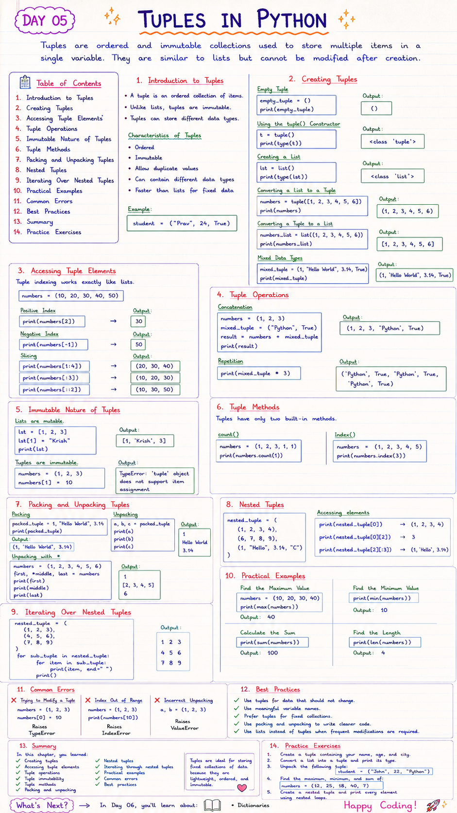

# 📘 Day 05: Tuples in Python

> Tuples are ordered and immutable collections used to store multiple items in a single variable. They are similar to lists but cannot be modified after creation.

---

## 📑 Table of Contents

- [Introduction to Tuples](#-introduction-to-tuples)
- [Creating Tuples](#-creating-tuples)
- [Accessing Tuple Elements](#-accessing-tuple-elements)
- [Tuple Operations](#-tuple-operations)
- [Immutable Nature of Tuples](#-immutable-nature-of-tuples)
- [Tuple Methods](#-tuple-methods)
- [Packing and Unpacking Tuples](#-packing-and-unpacking-tuples)
- [Nested Tuples](#-nested-tuples)
- [Iterating Over Nested Tuples](#-iterating-over-nested-tuples)
- [Practical Examples](#-practical-examples)
- [Common Errors](#-common-errors)
- [Best Practices](#-best-practices)
- [Summary](#-summary)
- [Practice Exercises](#-practice-exercises)

---



---

# 📖 Introduction to Tuples

A **tuple** is an ordered collection of items.

Unlike lists, tuples are **immutable**, meaning their elements cannot be changed after they are created.

Tuples can store different data types, including numbers, strings, Booleans, and even other tuples.

### Characteristics of Tuples

- Ordered
- Immutable
- Allow duplicate values
- Can contain different data types
- Faster than lists for fixed data

Example

```python
student = ("Prav", 24, True)
```

[⬆ Back to Top](#-table-of-contents)

---

# 📝 Creating Tuples

### Empty Tuple

```python
empty_tuple = ()

print(empty_tuple)
```

Output

```
()
```

---

### Using the `tuple()` Constructor

```python
t = tuple()

print(type(t))
```

Output

```
<class 'tuple'>
```

---

### Creating a List

```python
lst = list()

print(type(lst))
```

Output

```
<class 'list'>
```

---

### Converting a List to a Tuple

```python
numbers = tuple([1, 2, 3, 4, 5, 6])

print(numbers)
```

Output

```
(1, 2, 3, 4, 5, 6)
```

---

### Converting a Tuple to a List

```python
numbers_list = list((1, 2, 3, 4, 5, 6))

print(numbers_list)
```

Output

```
[1, 2, 3, 4, 5, 6]
```

---

### Mixed Data Types

```python
mixed_tuple = (1, "Hello World", 3.14, True)

print(mixed_tuple)
```

[⬆ Back to Top](#-table-of-contents)

---

# 🔍 Accessing Tuple Elements

Tuple indexing works exactly like lists.

```python
numbers = (10, 20, 30, 40, 50)
```

### Positive Index

```python
print(numbers[2])
```

Output

```
30
```

---

### Negative Index

```python
print(numbers[-1])
```

Output

```
50
```

---

### Slicing

```python
print(numbers[1:4])
```

Output

```
(20, 30, 40)
```

---

```python
print(numbers[:3])
```

Output

```
(10, 20, 30)
```

---

```python
print(numbers[::2])
```

Output

```
(10, 30, 50)
```

[⬆ Back to Top](#-table-of-contents)

---

# ➕ Tuple Operations

### Concatenation

```python
numbers = (1, 2, 3)

mixed_tuple = ("Python", True)

result = numbers + mixed_tuple

print(result)
```

Output

```
(1, 2, 3, 'Python', True)
```

---

### Repetition

```python
print(mixed_tuple * 3)
```

Output

```
('Python', True, 'Python', True, 'Python', True)
```

[⬆ Back to Top](#-table-of-contents)

---

# 🔒 Immutable Nature of Tuples

Lists are mutable.

```python
lst = [1, 2, 3]

lst[1] = "Krish"

print(lst)
```

Output

```
[1, 'Krish', 3]
```

Tuples are immutable.

```python
numbers = (1, 2, 3)

numbers[1] = 10
```

Output

```
TypeError: 'tuple' object does not support item assignment
```

[⬆ Back to Top](#-table-of-contents)

---

# ⚙️ Tuple Methods

Tuples have only two built-in methods.

### count()

Returns the number of occurrences.

```python
numbers = (1, 2, 3, 1, 1)

print(numbers.count(1))
```

Output

```
3
```

---

### index()

Returns the first index of an element.

```python
numbers = (1, 2, 3, 4, 5)

print(numbers.index(3))
```

Output

```
2
```

[⬆ Back to Top](#-table-of-contents)

---

# 📦 Packing and Unpacking Tuples

### Packing

Python automatically creates a tuple when values are separated by commas.

```python
packed_tuple = 1, "Hello World", 3.14

print(packed_tuple)
```

Output

```
(1, 'Hello World', 3.14)
```

---

### Unpacking

```python
a, b, c = packed_tuple

print(a)
print(b)
print(c)
```

Output

```
1
Hello World
3.14
```

---

### Unpacking with `*`

```python
numbers = (1, 2, 3, 4, 5, 6)

first, *middle, last = numbers

print(first)
print(middle)
print(last)
```

Output

```
1
[2, 3, 4, 5]
6
```

[⬆ Back to Top](#-table-of-contents)

---

# 🧩 Nested Tuples

A tuple can contain other tuples.

```python
nested_tuple = (
    (1, 2, 3, 4),
    (6, 7, 8, 9),
    (1, "Hello", 3.14, "C")
)
```

Accessing elements

```python
print(nested_tuple[0])
```

Output

```
(1, 2, 3, 4)
```

---

```python
print(nested_tuple[0][2])
```

Output

```
3
```

---

```python
print(nested_tuple[2][:3])
```

Output

```
(1, 'Hello', 3.14)
```

[⬆ Back to Top](#-table-of-contents)

---

# 🔄 Iterating Over Nested Tuples

```python
nested_tuple = (
    (1, 2, 3),
    (4, 5, 6),
    (7, 8, 9)
)

for sub_tuple in nested_tuple:

    for item in sub_tuple:
        print(item, end=" ")

    print()
```

Output

```
1 2 3
4 5 6
7 8 9
```

[⬆ Back to Top](#-table-of-contents)

---

# 🌍 Practical Examples

### Find the Maximum Value

```python
numbers = (10, 20, 30, 40)

print(max(numbers))
```

Output

```
40
```

---

### Find the Minimum Value

```python
print(min(numbers))
```

Output

```
10
```

---

### Calculate the Sum

```python
print(sum(numbers))
```

Output

```
100
```

---

### Find the Length

```python
print(len(numbers))
```

Output

```
4
```

[⬆ Back to Top](#-table-of-contents)

---

# ❌ Common Errors

### Trying to Modify a Tuple

```python
numbers = (1, 2, 3)

numbers[0] = 10
```

Raises

```
TypeError
```

---

### Index Out of Range

```python
numbers = (1, 2, 3)

print(numbers[10])
```

Raises

```
IndexError
```

---

### Incorrect Unpacking

```python
a, b = (1, 2, 3)
```

Raises

```
ValueError
```

[⬆ Back to Top](#-table-of-contents)

---

# ✅ Best Practices

- Use tuples for data that should not change.
- Use meaningful variable names.
- Prefer tuples for fixed collections.
- Use packing and unpacking to write cleaner code.
- Use lists instead of tuples when frequent modifications are required.

[⬆ Back to Top](#-table-of-contents)

---

# 📚 Summary

In this chapter, you learned:

- ✅ Creating tuples
- ✅ Accessing tuple elements
- ✅ Tuple operations
- ✅ Tuple immutability
- ✅ Tuple methods
- ✅ Packing and unpacking
- ✅ Nested tuples
- ✅ Iterating through nested tuples
- ✅ Practical examples
- ✅ Common errors
- ✅ Best practices

Tuples are ideal for storing fixed collections of data because they are lightweight, ordered, and immutable.

[⬆ Back to Top](#-table-of-contents)

---

# 💻 Practice Exercises

### Exercise 1

Create a tuple containing your name, age, and city.

---

### Exercise 2

Convert a list into a tuple and print its type.

---

### Exercise 3

Unpack the following tuple:

```python
student = ("John", 22, "Python")
```

---

### Exercise 4

Find the maximum, minimum, and sum of:

```python
numbers = (12, 25, 18, 40, 7)
```

---

### Exercise 5

Create a nested tuple and print every element using nested loops.

---

## 🎯 What's Next?

In **Day 06**, you'll learn about:
- 📖 Dictionaries

Happy Coding! 🚀