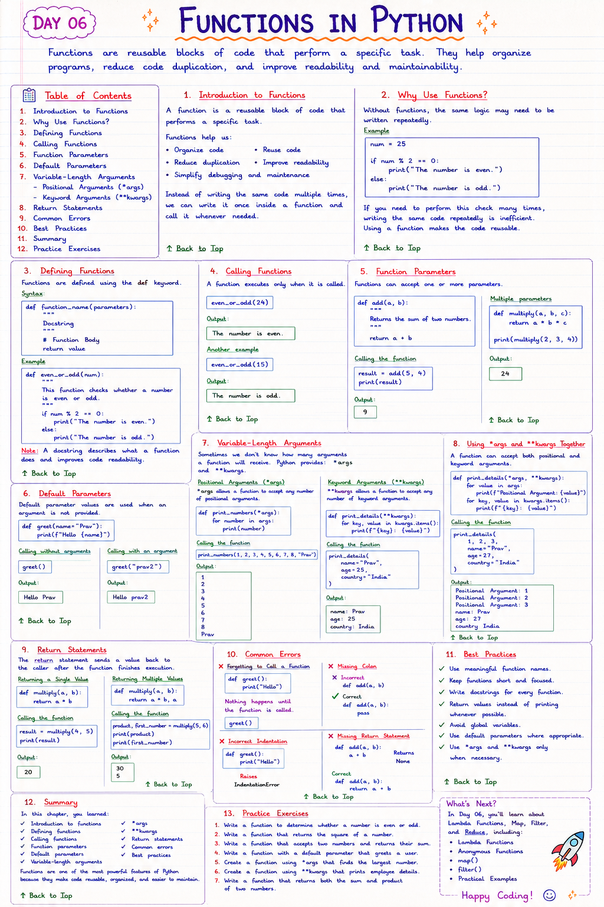

# 📘 Day 06: Functions in Python

> Functions are reusable blocks of code that perform a specific task. They help organize programs, reduce code duplication, and improve readability and maintainability.

---

## 📑 Table of Contents

- [Introduction to Functions](#-introduction-to-functions)
- [Why Use Functions?](#-why-use-functions)
- [Defining Functions](#-defining-functions)
- [Calling Functions](#-calling-functions)
- [Function Parameters](#-function-parameters)
- [Default Parameters](#-default-parameters)
- [Variable-Length Arguments](#-variable-length-arguments)
  - [Positional Arguments (`*args`)](#positional-arguments-args)
  - [Keyword Arguments (`**kwargs`)](#keyword-arguments-kwargs)
- [Return Statements](#-return-statements)
- [Common Errors](#-common-errors)
- [Best Practices](#-best-practices)
- [Summary](#-summary)
- [Practice Exercises](#-practice-exercises)

---



---

# 📖 Introduction to Functions

A **function** is a reusable block of code that performs a specific task.

Functions help us:

- Organize code
- Reuse code
- Reduce duplication
- Improve readability
- Simplify debugging and maintenance

Instead of writing the same code multiple times, we can write it once inside a function and call it whenever needed.

[⬆ Back to Top](#-table-of-contents)

---

# ⭐ Why Use Functions?

Without functions, the same logic may need to be written repeatedly.

Example

```python
num = 25

if num % 2 == 0:
    print("The number is even.")
else:
    print("The number is odd.")
```

If you need to perform this check many times, writing the same code repeatedly is inefficient.

Using a function makes the code reusable.

[⬆ Back to Top](#-table-of-contents)

---

# ✍️ Defining Functions

Functions are defined using the `def` keyword.

## Syntax

```python
def function_name(parameters):
    """
    Docstring
    """
    
    # Function Body
    
    return value
```

### Example

```python
def even_or_odd(num):
    """
    This function checks whether a number is even or odd.
    """

    if num % 2 == 0:
        print("The number is even.")
    else:
        print("The number is odd.")
```

> **Note:** A **docstring** describes what a function does and improves code readability.

[⬆ Back to Top](#-table-of-contents)

---

# ▶️ Calling Functions

A function executes only when it is called.

```python
even_or_odd(24)
```

Output

```
The number is even.
```

Another example

```python
even_or_odd(15)
```

Output

```
The number is odd.
```

[⬆ Back to Top](#-table-of-contents)

---

# 📥 Function Parameters

Functions can accept one or more parameters.

```python
def add(a, b):
    """
    Returns the sum of two numbers.
    """

    return a + b
```

Calling the function

```python
result = add(5, 4)

print(result)
```

Output

```
9
```

Functions can have multiple parameters.

```python
def multiply(a, b, c):
    return a * b * c

print(multiply(2, 3, 4))
```

Output

```
24
```

[⬆ Back to Top](#-table-of-contents)

---

# 🎯 Default Parameters

Default parameter values are used when an argument is not provided.

```python
def greet(name="Prav"):
    print(f"Hello {name}")
```

Calling without arguments

```python
greet()
```

Output

```
Hello Prav
```

Calling with an argument

```python
greet("prav2")
```

Output

```
Hello prav2
```

[⬆ Back to Top](#-table-of-contents)

---

# 🔄 Variable-Length Arguments

Sometimes we don't know how many arguments a function will receive.

Python provides:

- `*args`
- `**kwargs`

---

## Positional Arguments (`*args`)

`*args` allows a function to accept any number of positional arguments.

```python
def print_numbers(*args):

    for number in args:
        print(number)
```

Calling the function

```python
print_numbers(1, 2, 3, 4, 5, 6, 7, 8, "Prav")
```

Output

```
1
2
3
4
5
6
7
8
Prav
```

> **Best Practice:** Although the parameter name can be anything, `*args` is the standard convention.

[⬆ Back to Top](#-table-of-contents)

---

## Keyword Arguments (`**kwargs`)

`**kwargs` allows a function to accept any number of keyword arguments.

```python
def print_details(**kwargs):

    for key, value in kwargs.items():
        print(f"{key}: {value}")
```

Calling the function

```python
print_details(
    name="Prav",
    age=25,
    country="India"
)
```

Output

```
name: Prav
age: 25
country: India
```

> **Best Practice:** Use `**kwargs` when the number of keyword arguments is unknown.

[⬆ Back to Top](#-table-of-contents)

---

# 🔀 Using `*args` and `**kwargs` Together

A function can accept both positional and keyword arguments.

```python
def print_details(*args, **kwargs):

    for value in args:
        print(f"Positional Argument: {value}")

    for key, value in kwargs.items():
        print(f"{key}: {value}")
```

Calling the function

```python
print_details(
    1,
    2,
    3,
    name="Prav",
    age=27,
    country="India"
)
```

Output

```
Positional Argument: 1
Positional Argument: 2
Positional Argument: 3
name: Prav
age: 27
country: India
```

[⬆ Back to Top](#-table-of-contents)

---

# 🔙 Return Statements

The `return` statement sends a value back to the caller after the function finishes execution.

```python
def multiply(a, b):

    return a * b
```

Calling the function

```python
result = multiply(4, 5)

print(result)
```

Output

```
20
```

---

## Returning Multiple Values

Python functions can return multiple values.

```python
def multiply(a, b):

    return a * b, a
```

Calling the function

```python
product, first_number = multiply(5, 6)

print(product)
print(first_number)
```

Output

```
30
5
```

[⬆ Back to Top](#-table-of-contents)

---

# ❌ Common Errors

### Forgetting to Call a Function

```python
def greet():
    print("Hello")
```

Nothing happens until the function is called.

```python
greet()
```

---

### Missing Colon

❌ Incorrect

```python
def add(a, b)
```

✅ Correct

```python
def add(a, b):
```

---

### Incorrect Indentation

```python
def greet():
print("Hello")
```

Raises

```
IndentationError
```

---

### Missing Return Statement

```python
def add(a, b):
    a + b
```

Returns

```
None
```

Correct

```python
def add(a, b):
    return a + b
```

[⬆ Back to Top](#-table-of-contents)

---

# ✅ Best Practices

- Use meaningful function names.
- Keep functions short and focused.
- Write docstrings for every function.
- Return values instead of printing whenever possible.
- Avoid global variables.
- Use default parameters where appropriate.
- Use `*args` and `**kwargs` only when necessary.

[⬆ Back to Top](#-table-of-contents)

---

# 📚 Summary

In this chapter, you learned:

- ✅ Introduction to functions
- ✅ Defining functions
- ✅ Calling functions
- ✅ Function parameters
- ✅ Default parameters
- ✅ Variable-length arguments
- ✅ `*args`
- ✅ `**kwargs`
- ✅ Return statements
- ✅ Common errors
- ✅ Best practices

Functions are one of the most powerful features of Python because they make code reusable, organized, and easier to maintain.

[⬆ Back to Top](#-table-of-contents)

---

# 💻 Practice Exercises

### Exercise 1

Write a function to determine whether a number is even or odd.

---

### Exercise 2

Write a function that returns the square of a number.

---

### Exercise 3

Write a function that accepts two numbers and returns their sum.

---

### Exercise 4

Write a function with a default parameter that greets a user.

---

### Exercise 5

Create a function using `*args` that finds the largest number.

---

### Exercise 6

Create a function using `**kwargs` that prints employee details.

---

### Exercise 7

Write a function that returns both the sum and product of two numbers.

---

## 🎯 What's Next?

In **Day 07**, you'll learn about **Lambda Functions, Map, Filter, and Reduce**, including:

- 🔹 Lambda Functions
- 🔹 Anonymous Functions
- 🔹 `map()`
- 🔹 `filter()`
- 🔹 Practical Examples

Happy Coding! 🚀