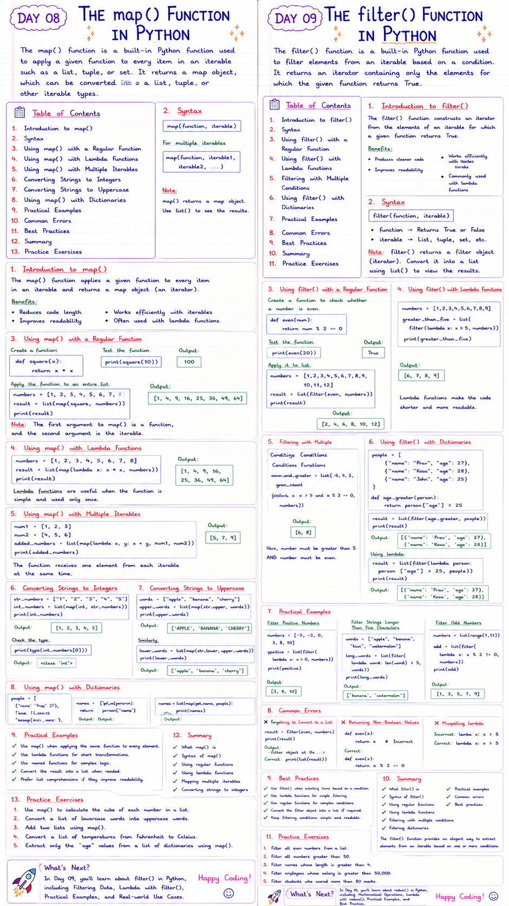

# 📘 Day 08: The `map()` Function in Python

> The `map()` function is a built-in Python function used to apply a given function to every item in an iterable such as a list, tuple, or set. It returns a **map object**, which can be converted into a list, tuple, or other iterable types.

---

## 📑 Table of Contents

- [Introduction to `map()`](#-introduction-to-map)
- [Syntax](#-syntax)
- [Using `map()` with a Regular Function](#-using-map-with-a-regular-function)
- [Using `map()` with Lambda Functions](#-using-map-with-lambda-functions)
- [Using `map()` with Multiple Iterables](#-using-map-with-multiple-iterables)
- [Converting Strings to Integers](#-converting-strings-to-integers)
- [Converting Strings to Uppercase](#-converting-strings-to-uppercase)
- [Using `map()` with Dictionaries](#-using-map-with-dictionaries)
- [Common Errors](#-common-errors)
- [Best Practices](#-best-practices)
- [Summary](#-summary)
- [Practice Exercises](#-practice-exercises)

---



---

# 📖 Introduction to `map()`

The **`map()`** function applies a given function to every item in an iterable (such as a list, tuple, or set) and returns a **map object** (an iterator).

It is commonly used to transform data without writing explicit loops.

### Benefits

- Reduces code length
- Improves readability
- Works efficiently with iterables
- Often used with lambda functions

[⬆ Back to Top](#-table-of-contents)

---

# ✍️ Syntax

```python
map(function, iterable)
```

For multiple iterables

```python
map(function, iterable1, iterable2, ...)
```

> **Note:** `map()` returns a map object. Use `list()` to see the results.

[⬆ Back to Top](#-table-of-contents)

---

# 🔄 Using `map()` with a Regular Function

Create a function that returns the square of a number.

```python
def square(x):
    return x * x
```

Test the function.

```python
print(square(10))
```

Output

```
100
```

Apply the function to an entire list.

```python
numbers = [1, 2, 3, 4, 5, 6, 7, 8]

result = list(map(square, numbers))

print(result)
```

Output

```
[1, 4, 9, 16, 25, 36, 49, 64]
```

> **Note:** The first argument to `map()` is a function, and the second argument is the iterable.

[⬆ Back to Top](#-table-of-contents)

---

# ⚡ Using `map()` with Lambda Functions

Instead of defining a separate function, you can use a lambda function.

```python
numbers = [1, 2, 3, 4, 5, 6, 7, 8]

result = list(map(lambda x: x * x, numbers))

print(result)
```

Output

```
[1, 4, 9, 16, 25, 36, 49, 64]
```

Lambda functions are useful when the function is simple and used only once.

[⬆ Back to Top](#-table-of-contents)

---

# 🔀 Using `map()` with Multiple Iterables

`map()` can process multiple iterables simultaneously.

```python
num1 = [1, 2, 3]

num2 = [4, 5, 6]

added_numbers = list(map(lambda x, y: x + y, num1, num2))

print(added_numbers)
```

Output

```
[5, 7, 9]
```

The function receives one element from each iterable at the same time.

[⬆ Back to Top](#-table-of-contents)

---

# 🔢 Converting Strings to Integers

Suppose we have a list of strings.

```python
str_numbers = ["1", "2", "3", "4", "5"]
```

Convert them into integers.

```python
int_numbers = list(map(int, str_numbers))

print(int_numbers)
```

Output

```
[1, 2, 3, 4, 5]
```

Check the type.

```python
print(type(int_numbers[0]))
```

Output

```
<class 'int'>
```

[⬆ Back to Top](#-table-of-contents)

---

# 🔠 Converting Strings to Uppercase

```python
words = ["apple", "banana", "cherry"]

upper_words = list(map(str.upper, words))

print(upper_words)
```

Output

```
['APPLE', 'BANANA', 'CHERRY']
```

Similarly,

```python
lower_words = list(map(str.lower, upper_words))

print(lower_words)
```

Output

```
['apple', 'banana', 'cherry']
```

[⬆ Back to Top](#-table-of-contents)

---

# 📚 Using `map()` with Dictionaries

Suppose we have a list of dictionaries.

```python
people = [
    {"name": "Prav", "age": 27},
    {"name": "Kosa", "age": 28},
    {"name": "Ravi", "age": 30}
]
```

Create a function.

```python
def get_name(person):
    return person["name"]
```

Apply it using `map()`.

```python
names = list(map(get_name, people))

print(names)
```

Output

```
['Prav', 'Kosa', 'Ravi']
```

The same can be written using a lambda function.

```python
names = list(map(lambda person: person["name"], people))

print(names)
```

Output

```
['Prav', 'Kosa', 'Ravi']
```

[⬆ Back to Top](#-table-of-contents)

---

# 🌍 Practical Examples

## Double Every Number

```python
numbers = [1, 2, 3, 4, 5]

result = list(map(lambda x: x * 2, numbers))

print(result)
```

Output

```
[2, 4, 6, 8, 10]
```

---

## Calculate String Lengths

```python
words = ["Python", "Java", "C++"]

lengths = list(map(len, words))

print(lengths)
```

Output

```
[6, 4, 3]
```

---

## Convert Temperatures

```python
celsius = [0, 10, 20, 30]

fahrenheit = list(
    map(lambda c: (c * 9/5) + 32, celsius)
)

print(fahrenheit)
```

Output

```
[32.0, 50.0, 68.0, 86.0]
```

[⬆ Back to Top](#-table-of-contents)

---

# ❌ Common Errors

### Forgetting `list()`

```python
result = map(square, numbers)

print(result)
```

Output

```
<map object at 0x...>
```

Correct

```python
print(list(result))
```

---

### Different Length Iterables

```python
num1 = [1, 2, 3]

num2 = [4]
```

`map()` stops when the shortest iterable ends.

Output

```
[5]
```

---

### Misspelling `lambda`

Incorrect

```python
lamba x: x*x
```

Correct

```python
lambda x: x*x
```

[⬆ Back to Top](#-table-of-contents)

---

# ✅ Best Practices

- Use `map()` when applying the same function to every element.
- Use lambda functions for short transformations.
- Use named functions for complex logic.
- Convert the result into a list when needed.
- Prefer list comprehensions if they improve readability.

[⬆ Back to Top](#-table-of-contents)

---

# 📚 Summary

In this chapter, you learned:

- ✅ What `map()` is
- ✅ Syntax of `map()`
- ✅ Using regular functions
- ✅ Using lambda functions
- ✅ Mapping multiple iterables
- ✅ Converting strings to integers
- ✅ Working with dictionaries
- ✅ Practical examples
- ✅ Common errors
- ✅ Best practices

The `map()` function is a powerful tool for transforming data efficiently while writing clean and concise Python code.

[⬆ Back to Top](#-table-of-contents)

---

# 💻 Practice Exercises

### Exercise 1

Use `map()` to calculate the cube of each number in a list.

---

### Exercise 2

Convert a list of lowercase words into uppercase words.

---

### Exercise 3

Add two lists using `map()`.

---

### Exercise 4

Convert a list of temperatures from Fahrenheit to Celsius.

---

### Exercise 5

Extract only the `"age"` values from a list of dictionaries using `map()`.

---

## 🎯 What's Next?

In **Day 09**, you'll learn about **`filter()` in Python**, including:

- 🔍 Filtering Data
- 🎯 Lambda with `filter()`
- 📋 Practical Examples
- 🚀 Real-world Use Cases

Happy Coding! 🚀