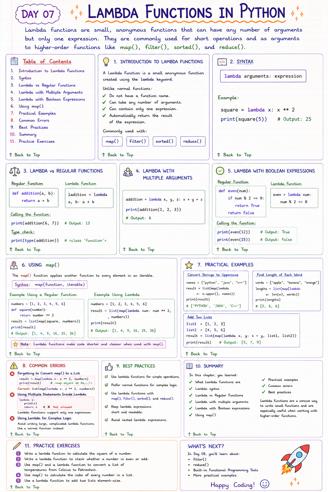

# 📘 Day 07: Lambda Functions in Python

> Lambda functions are small, anonymous functions that can have any number of arguments but only one expression. They are commonly used for short operations and as arguments to higher-order functions like `map()`, `filter()`, and `sorted()`.

---

## 📑 Table of Contents

- [Introduction to Lambda Functions](#-introduction-to-lambda-functions)
- [Syntax](#-syntax)
- [Lambda vs Regular Functions](#-lambda-vs-regular-functions)
- [Lambda with Multiple Arguments](#-lambda-with-multiple-arguments)
- [Lambda with Boolean Expressions](#-lambda-with-boolean-expressions)
- [Using `map()`](#-using-map)
- [Practical Examples](#-practical-examples)
- [Common Errors](#-common-errors)
- [Best Practices](#-best-practices)
- [Summary](#-summary)
- [Practice Exercises](#-practice-exercises)

---



---

# 📖 Introduction to Lambda Functions

A **Lambda Function** is a small anonymous function created using the `lambda` keyword.

Unlike normal functions, lambda functions:

- Do not have a function name.
- Can take any number of arguments.
- Can contain only one expression.
- Automatically return the result of the expression.

They are commonly used with functions such as:

- `map()`
- `filter()`
- `sorted()`
- `reduce()`

[⬆ Back to Top](#-table-of-contents)

---

# ✍️ Syntax

```python
lambda arguments: expression
```

Example

```python
square = lambda x: x ** 2

print(square(5))
```

Output

```
25
```

[⬆ Back to Top](#-table-of-contents)

---

# 🔄 Lambda vs Regular Functions

### Regular Function

```python
def addition(a, b):
    return a + b
```

### Lambda Function

```python
addition = lambda a, b: a + b
```

Calling the function

```python
print(addition(6, 7))
```

Output

```
13
```

Check its type.

```python
print(type(addition))
```

Output

```
<class 'function'>
```

[⬆ Back to Top](#-table-of-contents)

---

# ➕ Lambda with Multiple Arguments

Lambda functions can accept multiple parameters.

```python
addition = lambda x, y, z: x + y + z

print(addition(1, 2, 3))
```

Output

```
6
```

[⬆ Back to Top](#-table-of-contents)

---

# ✅ Lambda with Boolean Expressions

Regular Function

```python
def even(num):

    if num % 2 == 0:
        return True

    return False
```

Lambda Function

```python
even = lambda num: num % 2 == 0
```

Calling the function

```python
print(even(12))

print(even(15))
```

Output

```
True

False
```

[⬆ Back to Top](#-table-of-contents)

---

# 🗺️ Using `map()`

The `map()` function applies another function to every element in an iterable.

## Syntax

```python
map(function, iterable)
```

Since `map()` returns a map object, we usually convert it into a list.

### Example Using a Regular Function

```python
numbers = [1, 2, 3, 4, 5, 6]

def square(number):
    return number ** 2

result = list(map(square, numbers))

print(result)
```

Output

```
[1, 4, 9, 16, 25, 36]
```

---

### Example Using Lambda

```python
numbers = [1, 2, 3, 4, 5, 6]

result = list(map(lambda num: num ** 2, numbers))

print(result)
```

Output

```
[1, 4, 9, 16, 25, 36]
```

> **Note:** Lambda functions make code shorter and cleaner when used with `map()`.

[⬆ Back to Top](#-table-of-contents)

---

# 🌍 Practical Examples

## Convert Strings to Uppercase

```python
names = ["python", "java", "c++"]

result = list(map(lambda name: name.upper(), names))

print(result)
```

Output

```
['PYTHON', 'JAVA', 'C++']
```

---

## Find the Length of Each Word

```python
words = ["apple", "banana", "orange"]

lengths = list(map(lambda word: len(word), words))

print(lengths)
```

Output

```
[5, 6, 6]
```

---

## Add Two Lists

```python
list1 = [1, 2, 3]

list2 = [4, 5, 6]

result = list(map(lambda x, y: x + y, list1, list2))

print(result)
```

Output

```
[5, 7, 9]
```

[⬆ Back to Top](#-table-of-contents)

---

# ❌ Common Errors

### Forgetting to Convert `map()` to a List

Incorrect

```python
result = map(lambda x: x ** 2, numbers)

print(result)
```

Output

```
<map object at 0x...>
```

Correct

```python
result = list(map(lambda x: x ** 2, numbers))
```

---

### Using Multiple Statements Inside Lambda

Incorrect

```python
lambda x:
    print(x)
    return x
```

Lambda functions support **only one expression**.

---

### Using Lambda for Complex Logic

Avoid writing large, complicated lambda functions.

Use a normal function instead.

[⬆ Back to Top](#-table-of-contents)

---

# ✅ Best Practices

- Use lambda functions for simple operations.
- Prefer normal functions for complex logic.
- Use lambda functions with `map()`, `filter()`, and `sorted()`.
- Keep lambda expressions short and readable.
- Avoid nested lambda expressions.

[⬆ Back to Top](#-table-of-contents)

---

# 📚 Summary

In this chapter, you learned:

- ✅ What Lambda Functions are
- ✅ Lambda syntax
- ✅ Lambda vs Regular Functions
- ✅ Lambda with multiple arguments
- ✅ Lambda with Boolean expressions
- ✅ Using `map()`
- ✅ Practical examples
- ✅ Common errors
- ✅ Best practices

Lambda functions are a concise way to write small functions and are especially useful when working with higher-order functions.

[⬆ Back to Top](#-table-of-contents)

---

# 💻 Practice Exercises

### Exercise 1

Write a lambda function to calculate the square of a number.

---

### Exercise 2

Write a lambda function to check whether a number is even or odd.

---

### Exercise 3

Use `map()` and a lambda function to convert a list of temperatures from Celsius to Fahrenheit.

---

### Exercise 4

Use `map()` to calculate the cube of every number in a list.

---

### Exercise 5

Use a lambda function to add two lists element-wise.

---

## 🎯 What's Next?

In **Day 08**, you'll learn about:

- 🎯 `filter()`
- 🔄 `reduce()`
- 📦 Built-in Functional Programming Tools
- 🧠 Practical Examples with Lambda Functions

Happy Coding! 🚀