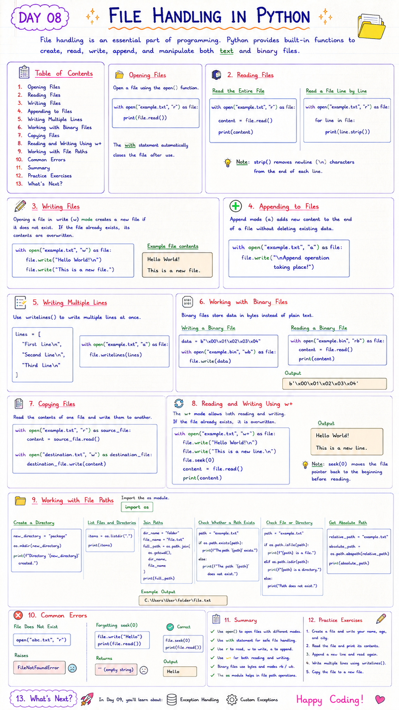

# 📘 Day 8: File Handling in Python

> File handling is an essential part of programming. Python provides built-in functions to create, read, write, append, and manipulate both **text** and **binary** files.

---

## 📑 Table of Contents

- [Introduction to File Handling](#-introduction-to-file-handling)
- [Opening Files](#-opening-files)
- [Reading Files](#-reading-files)
- [Writing Files](#-writing-files)
- [Appending to Files](#-appending-to-files)
- [Writing Multiple Lines](#-writing-multiple-lines)
- [Working with Binary Files](#-working-with-binary-files)
- [Copying Files](#-copying-files)
- [Reading and Writing Using `w+`](#-reading-and-writing-using-w)
- [Working with File Paths](#-working-with-file-paths)
- [Common Errors](#-common-errors)
- [Best Practices](#-best-practices)
- [Summary](#-summary)
- [Practice Exercises](#-practice-exercises)

---



---

# 📖 Introduction to File Handling

File handling allows programs to:

- Read data from files
- Write data to files
- Store information permanently
- Process text and binary files

Python provides the built-in **`open()`** function to work with files.

## Common File Modes

| Mode | Description |
|------|-------------|
| `r` | Read (default) |
| `w` | Write (overwrites existing file) |
| `a` | Append to existing file |
| `x` | Create a new file |
| `rb` | Read binary file |
| `wb` | Write binary file |
| `r+` | Read and write |
| `w+` | Read and write (overwrites existing file) |

> **Best Practice:** Use the `with` statement when working with files. It automatically closes the file.

[⬆ Back to Top](#-table-of-contents)

---

# 📂 Opening Files

```python
with open("example.txt", "r") as file:
    print(file.read())
```

The `with` statement automatically closes the file after use.

[⬆ Back to Top](#-table-of-contents)

---

# 📖 Reading Files

## Read the Entire File

```python
with open("example.txt", "r") as file:

    content = file.read()

    print(content)
```

---

## Read a File Line by Line

```python
with open("example.txt", "r") as file:

    for line in file:
        print(line.strip())
```

> **Note:** `strip()` removes newline (`\n`) characters from the end of each line.

[⬆ Back to Top](#-table-of-contents)

---

# ✍️ Writing Files

Opening a file in **write (`w`) mode** creates a new file if it does not exist.

If the file already exists, its contents are overwritten.

```python
with open("example.txt", "w") as file:

    file.write("Hello World!\n")

    file.write("This is a new file.")
```

Example file contents

```
Hello World!

This is a new file.
```

[⬆ Back to Top](#-table-of-contents)

---

# ➕ Appending to Files

Append mode (`a`) adds new content to the end of a file without deleting existing data.

```python
with open("example.txt", "a") as file:

    file.write("\nAppend operation taking place!")
```

[⬆ Back to Top](#-table-of-contents)

---

# 📝 Writing Multiple Lines

Use `writelines()` to write multiple lines at once.

```python
lines = [
    "First Line\n",
    "Second Line\n",
    "Third Line\n"
]

with open("example.txt", "a") as file:

    file.writelines(lines)
```

[⬆ Back to Top](#-table-of-contents)

---

# 💾 Working with Binary Files

Binary files store data in bytes instead of plain text.

## Writing a Binary File

```python
data = b"\x00\x01\x02\x03\x04"

with open("example.bin", "wb") as file:

    file.write(data)
```

---

## Reading a Binary File

```python
with open("example.bin", "rb") as file:

    content = file.read()

    print(content)
```

Output

```
b'\x00\x01\x02\x03\x04'
```

[⬆ Back to Top](#-table-of-contents)

---

# 📋 Copying Files

Read the contents of one file and write them to another.

```python
with open("example.txt", "r") as source_file:

    content = source_file.read()

with open("destination.txt", "w") as destination_file:

    destination_file.write(content)
```

[⬆ Back to Top](#-table-of-contents)

---

# 🔄 Reading and Writing Using `w+`

The `w+` mode allows both reading and writing.

If the file already exists, it is overwritten.

```python
with open("example.txt", "w+") as file:

    file.write("Hello World!\n")

    file.write("This is a new line.\n")

    file.seek(0)

    content = file.read()

    print(content)
```

Output

```
Hello World!

This is a new line.
```

> **Note:** `seek(0)` moves the file pointer back to the beginning before reading.

[⬆ Back to Top](#-table-of-contents)

---

# 📁 Working with File Paths

Import the `os` module.

```python
import os
```

---

## Create a Directory

```python
new_directory = "package"

os.mkdir(new_directory)

print(f"Directory '{new_directory}' created.")
```

---

## List Files and Directories

```python
items = os.listdir(".")

print(items)
```

---

## Join Paths

```python
dir_name = "folder"

file_name = "file.txt"

full_path = os.path.join(
    os.getcwd(),
    dir_name,
    file_name
)

print(full_path)
```

Example Output

```
C:\Users\User\folder\file.txt
```

---

## Check Whether a Path Exists

```python
path = "example.txt"

if os.path.exists(path):
    print(f"The path '{path}' exists.")
else:
    print(f"The path '{path}' does not exist.")
```

---

## Check Whether a Path is a File or Directory

```python
path = "example.txt"

if os.path.isfile(path):

    print(f"{path} is a file.")

elif os.path.isdir(path):

    print(f"{path} is a directory.")

else:

    print("Path does not exist.")
```

---

## Get Absolute Path

```python
relative_path = "example.txt"

absolute_path = os.path.abspath(relative_path)

print(absolute_path)
```

[⬆ Back to Top](#-table-of-contents)

---

# ❌ Common Errors

## File Does Not Exist

```python
open("abc.txt", "r")
```

Raises

```
FileNotFoundError
```

---

## Forgetting `seek(0)`

```python
file.write("Hello")

print(file.read())
```

Returns

```
''
```

Correct

```python
file.seek(0)

print(file.read())
```

---

## Misspelled Function

Incorrect

```python
os.lisdir()
```

Correct

```python
os.listdir()
```

---

## Missing Quotes

Incorrect

```python
print(f"The path '{path}' exists)
```

Correct

```python
print(f"The path '{path}' exists.")
```

[⬆ Back to Top](#-table-of-contents)

---

# ✅ Best Practices

- Always use `with open()` when working with files.
- Choose the correct file mode (`r`, `w`, `a`, etc.).
- Use `seek()` when switching between writing and reading.
- Handle exceptions when opening files.
- Close files automatically using context managers.
- Use descriptive file names.

[⬆ Back to Top](#-table-of-contents)

---

# 📚 Summary

In this chapter, you learned:

- ✅ Opening files
- ✅ Reading files
- ✅ Writing files
- ✅ Appending data
- ✅ Writing multiple lines
- ✅ Binary files
- ✅ Copying files
- ✅ `w+` mode
- ✅ Working with file paths
- ✅ Common errors
- ✅ Best practices

File handling is a fundamental skill in Python and is widely used for storing, retrieving, and processing data.

[⬆ Back to Top](#-table-of-contents)

---

# 💻 Practice Exercises

### Exercise 1

Create a text file and write your name and city into it.

---

### Exercise 2

Read the contents of a text file line by line.

---

### Exercise 3

Append five new lines to an existing file.

---

### Exercise 4

Copy the contents of one file into another.

---

### Exercise 5

Create a binary file and read its contents.

---

### Exercise 6

Check whether a file exists before opening it.

---

### Exercise 7

Print the absolute path of a file.

---

## 🎯 What's Next?

In **Day 13**, you'll learn about **Exception Handling in Python**, including:

- ⚠️ Types of Exceptions
- 🛡️ `try` and `except`
- ✅ `else`
- 🔚 `finally`
- 🚀 Raising Exceptions
- 🌍 Practical Examples

Happy Coding! 🚀