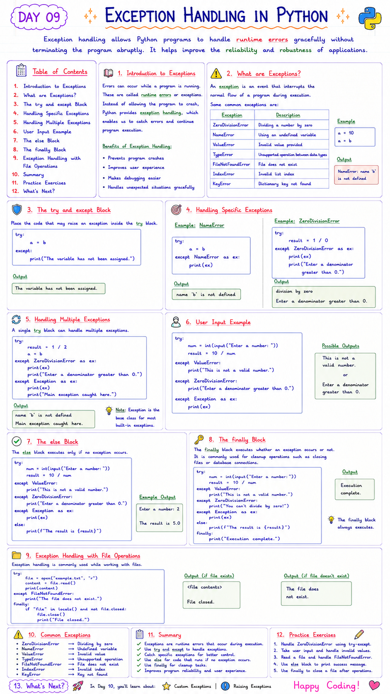

# 📘 Day 09: Exception Handling in Python

> Exception handling allows Python programs to handle runtime errors gracefully without terminating the program abruptly. It helps improve the reliability and robustness of applications.

---

## 📑 Table of Contents

- [Introduction to Exceptions](#-introduction-to-exceptions)
- [What are Exceptions?](#-what-are-exceptions)
- [The `try` and `except` Block](#-the-try-and-except-block)
- [Handling Specific Exceptions](#-handling-specific-exceptions)
- [Handling Multiple Exceptions](#-handling-multiple-exceptions)
- [User Input Example](#-user-input-example)
- [The `else` Block](#-the-else-block)
- [The `finally` Block](#-the-finally-block)
- [Exception Handling with File Operations](#-exception-handling-with-file-operations)
- [Common Errors](#-common-errors)
- [Best Practices](#-best-practices)
- [Summary](#-summary)
- [Practice Exercises](#-practice-exercises)

---



---

# 📖 Introduction to Exceptions

Errors can occur while a program is running. These are called **runtime errors** or **exceptions**.

Instead of allowing the program to crash, Python provides **exception handling**, which enables us to catch errors and continue program execution.

Benefits of Exception Handling:

- Prevents program crashes
- Improves user experience
- Makes debugging easier
- Handles unexpected situations gracefully

[⬆ Back to Top](#-table-of-contents)

---

# ⚠️ What are Exceptions?

An **exception** is an event that interrupts the normal flow of a program during execution.

Some common exceptions are:

| Exception | Description |
|-----------|-------------|
| `ZeroDivisionError` | Dividing a number by zero |
| `NameError` | Using an undefined variable |
| `ValueError` | Invalid value provided |
| `TypeError` | Unsupported operation between data types |
| `FileNotFoundError` | File does not exist |
| `IndexError` | Invalid list index |
| `KeyError` | Dictionary key not found |

Example

```python
a = 10

a = b
```

Output

```
NameError: name 'b' is not defined
```

[⬆ Back to Top](#-table-of-contents)

---

# 🛡️ The `try` and `except` Block

Place the code that may raise an exception inside the `try` block.

```python
try:
    a = b

except:
    print("The variable has not been assigned.")
```

Output

```
The variable has not been assigned.
```

[⬆ Back to Top](#-table-of-contents)

---

# 🎯 Handling Specific Exceptions

Instead of catching every exception, it is better to catch specific exceptions.

### Example: `NameError`

```python
try:
    a = b

except NameError as ex:
    print(ex)
```

Output

```
name 'b' is not defined
```

---

### Example: `ZeroDivisionError`

```python
try:
    result = 1 / 0

except ZeroDivisionError as ex:
    print(ex)
    print("Enter a denominator greater than 0.")
```

Output

```
division by zero

Enter a denominator greater than 0.
```

[⬆ Back to Top](#-table-of-contents)

---

# 🔄 Handling Multiple Exceptions

A single `try` block can handle multiple exceptions.

```python
try:
    result = 1 / 2
    a = b

except ZeroDivisionError as ex:
    print(ex)
    print("Enter a denominator greater than 0.")

except Exception as ex:
    print(ex)
    print("Main exception caught here.")
```

Output

```
name 'b' is not defined

Main exception caught here.
```

> **Note:** `Exception` is the base class for most built-in exceptions.

[⬆ Back to Top](#-table-of-contents)

---

# 💡 User Input Example

```python
try:

    num = int(input("Enter a number: "))

    result = 10 / num

except ValueError:
    print("This is not a valid number.")

except ZeroDivisionError:
    print("Enter a denominator greater than 0.")

except Exception as ex:
    print(ex)
```

Possible Outputs

```
This is not a valid number.
```

or

```
Enter a denominator greater than 0.
```

[⬆ Back to Top](#-table-of-contents)

---

# ✅ The `else` Block

The `else` block executes only if **no exception occurs**.

```python
try:

    num = int(input("Enter a number: "))

    result = 10 / num

except ValueError:
    print("This is not a valid number.")

except ZeroDivisionError:
    print("Enter a denominator greater than 0.")

except Exception as ex:
    print(ex)

else:
    print(f"The result is {result}")
```

Example Output

```
Enter a number: 2

The result is 5.0
```

[⬆ Back to Top](#-table-of-contents)

---

# 🏁 The `finally` Block

The `finally` block executes **whether an exception occurs or not**.

It is commonly used for cleanup operations such as closing files or database connections.

```python
try:

    num = int(input("Enter a number: "))

    result = 10 / num

except ValueError:
    print("This is not a valid number.")

except ZeroDivisionError:
    print("You can't divide by zero!")

except Exception as ex:
    print(ex)

else:
    print(f"The result is {result}")

finally:
    print("Execution complete.")
```

Output

```
Execution complete.
```

The `finally` block always executes.

[⬆ Back to Top](#-table-of-contents)

---

# 📂 Exception Handling with File Operations

Exception handling is commonly used while working with files.

```python
try:

    file = open("example.txt", "r")

    content = file.read()

    print(content)

except FileNotFoundError:
    print("The file does not exist.")

finally:

    if "file" in locals() and not file.closed:
        file.close()
        print("File closed.")
```

Output (if file exists)

```
<file contents>

File closed.
```

Output (if file doesn't exist)

```
The file does not exist.
```

[⬆ Back to Top](#-table-of-contents)

---

# ❌ Common Errors

### Catching Every Exception

```python
except:
```

Although valid, this is not recommended.

Use

```python
except Exception as ex:
```

instead.

---

### Wrong Exception Name

Incorrect

```python
except ZeroDivision Error:
```

Correct

```python
except ZeroDivisionError:
```

---

### Forgetting `finally`

Files or database connections may remain open if cleanup code is omitted.

Always use

```python
finally:
```

for cleanup.

---

### Accessing an Undefined Variable

```python
print(result)
```

If an exception occurs before `result` is assigned, Python raises another exception.

[⬆ Back to Top](#-table-of-contents)

---

# ✅ Best Practices

- Catch specific exceptions whenever possible.
- Avoid using a blank `except`.
- Use `finally` for cleanup tasks.
- Keep `try` blocks as small as possible.
- Display meaningful error messages.
- Use `Exception` only as a last resort.

[⬆ Back to Top](#-table-of-contents)

---

# 📚 Summary

In this chapter, you learned:

- ✅ What exceptions are
- ✅ Common exception types
- ✅ `try` block
- ✅ `except` block
- ✅ Handling multiple exceptions
- ✅ `else` block
- ✅ `finally` block
- ✅ File handling with exceptions
- ✅ Common mistakes
- ✅ Best practices

Exception handling is an essential skill that makes Python programs more reliable, user-friendly, and easier to maintain.

[⬆ Back to Top](#-table-of-contents)

---

# 💻 Practice Exercises

### Exercise 1

Write a program that catches a `ZeroDivisionError`.

---

### Exercise 2

Handle invalid user input using `ValueError`.

---

### Exercise 3

Open a file and display a custom message if it does not exist.

---

### Exercise 4

Write a program using `try`, `except`, `else`, and `finally`.

---

### Exercise 5

Create a calculator program that handles:

- Invalid input
- Division by zero
- Unexpected exceptions

---

## 🎯 What's Next?

In **Day 10**, you'll learn about **Object-Oriented Programming (OOP) in Python**, including:

- 🧱 Classes and Objects
- 🧬 Inheritance
- 🎭 Polymorphism
- 🔒 Encapsulation and Abstraction
- ✨ Magic Methods and Operator Overloading

Happy Coding! 🚀